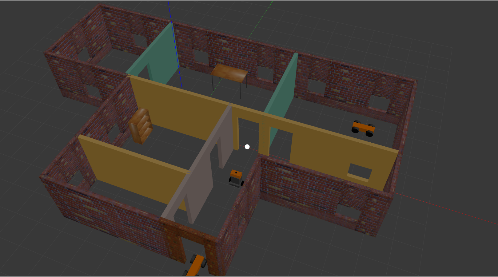

# robotics

Robotics is :heart:

## motivation

So I got admitted into Udacity's Robotics Nano Degree program, which is going on amazing :smile:

Learning a lot of new stuff, so I decided to share all projects that I'm going to build during this course.

## work

### platform requirement

I'm using _Ubuntu 18.04.4 LTS_, on which ROS Melodic, Gazebo9 all are working very fine. I tried using VirtualBox, performance was very bad, so switched to real machine.

### projects

- [x] [Build my world](docs/gazebo_project_one.md)
- [x] [Go chase it](docs/go_chase_it.md)
- [ ] Optimize Github Profile

Thanking you :blush:
