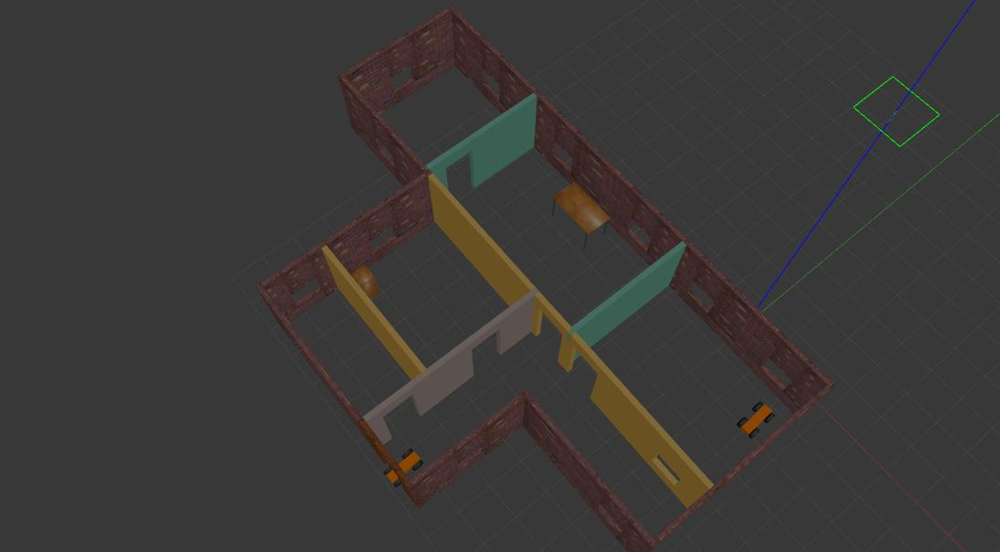

# Build My World




- Here we're going to design one building using Building Editor tool in Gazebo.
- Then one robot to be modeled, using Model Editor, which is to be placed twice in environment.
- Then in our world, robot model & building to be imported, along with template models from Gazebo Online Model Database. Finally world to be exported into *.world file.

```bash
$ tree -h gazebo_project_one/ # project directory hierarchy
gazebo_project_one/
├── [ 328]  CMakeLists.txt
├── [4.0K]  model
│   ├── [4.0K]  my_house
│   │   ├── [ 288]  model.config
│   │   └── [ 49K]  model.sdf
│   └── [4.0K]  robot_in_my_house
│       ├── [ 308]  model.config
│       └── [ 19K]  model.sdf
├── [4.0K]  scripts
│   └── [ 348]  hello_model.cpp
└── [4.0K]  world
    └── [141K]  my_house_with_robots

5 directories, 7 files
```

- Here comes the interesting part - Plugins
    - We're going to write a model plugin using C++ API of Gazebo, which will be compiled into a dynamic library & finally inserted into SDF formatted _world/my_house_with_robots_ file.
    - Get into `gazebo_project_one`, after cloning this repo
    
    ```bash
    $ cd gazebo_project_one/
    ```

    - Make a build directory
    
    ```bash
    $ mkdir build
    $ cd build
    ```

    - Now compile model plugin into shared library, using cmake & make.

    ```bash
    $ cmake ../
    $ make
    ```

    - If everything goes well, you'll find `libhello_model.so` inside this directory. Now get out of build directory & update `GAZEBO_PLUGIN_PATH` environment variable for this shell.
    
    ```bash
    $ cd ..
    $ export GAZEBO_PLUGIN_PATH=${GAZEBO_PLUGIN_PATH}:.build/
    ```

    - Now go to `world` directory & open world file with gazebo.

    ```bash
    $ gazebo my_house_with_robots # now check console for message printed by model plugin
    ```
