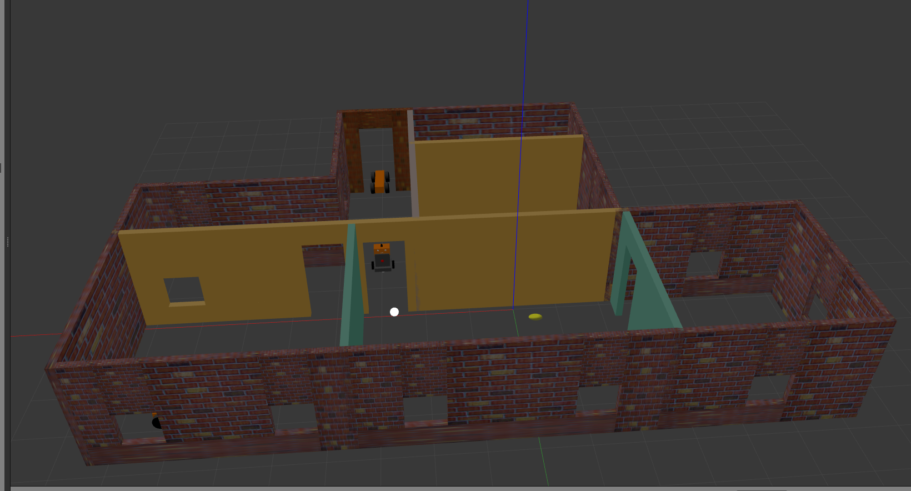

# Go Chase It




- We're going to design a two wheeled humanoid robot with one Camera & LiDaR sensor, which will be placed inside world designed in previous [project](./gazebo_project_one.md).
- First clone this repo into your local environment which is having ROS Melodic & Gazebo9 installed. 
    - ROS Melodic installation guide can be obtained from [here](https://wiki.ros.org/melodic/Installation/Ubuntu).
    - Install Gazebo9 from [here](http://gazebosim.org/tutorials?tut=install_ubuntu&cat=install).

```bash
$ git clone https://github.com/itzmeanjan/robotics.git
```

- Create a new catkin workspace

```bash
$ cd ~
$ mkdir catkin_ws
$ cd catkin_ws
$ mkdir src
$ catkin_init_workspace
$ cd {cloned_dir_path} # cloned_dir_path - path to local copy of cloned repo
```

- Now copy `ball_chaser` & `my_robot` - these two catkin packages from `robotics/go_chase_it_project_two/` into newly created workspace.

```bash
$ cp robotics/go_chase_it_project_two/* ~/catkin_ws/src/ -rv
$ cd ~/catkin_ws
```

- Now compile packages inside catkin workspace by running following shell command

```bash
$ catkin_make # if everything goes well, we're good to source setup script
```

- Source setup script, which will perform proper path setting & facilitate shell command autocompletion. **This step needs to be performed for each shell you open under workspace**

```bash
$ source devel/setup.bash
```

- Time to launch robot inside our world, in first terminal type in

```bash
$ roslaunch my_robot world.launch
```

- In another terminal, launching two more ros nodes, which will provide ball detection & robot driving features.

```bash
$ roslaunch ball_chaser ball_chaser.launch
```

- Now you can see our robot is chasing any ball it's finding in front of it. Start rviz to see, how robot is visualizing world.

```bash
$ roslaunch rqt_image_view rqt_image_view
```

- Try changing ball position in world & have fun.

Thanking you :blush:
